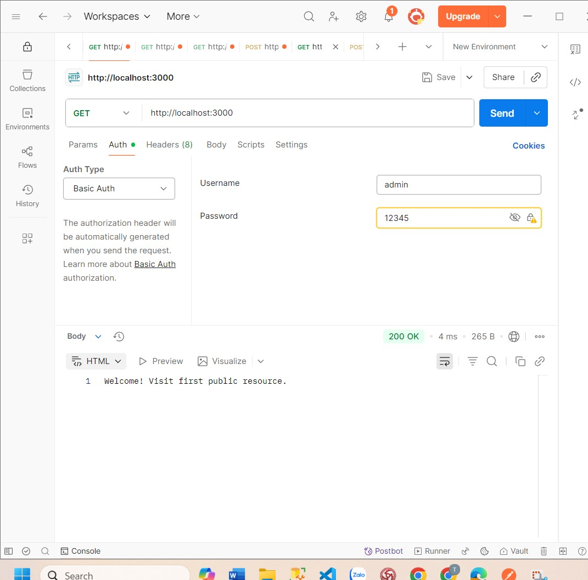
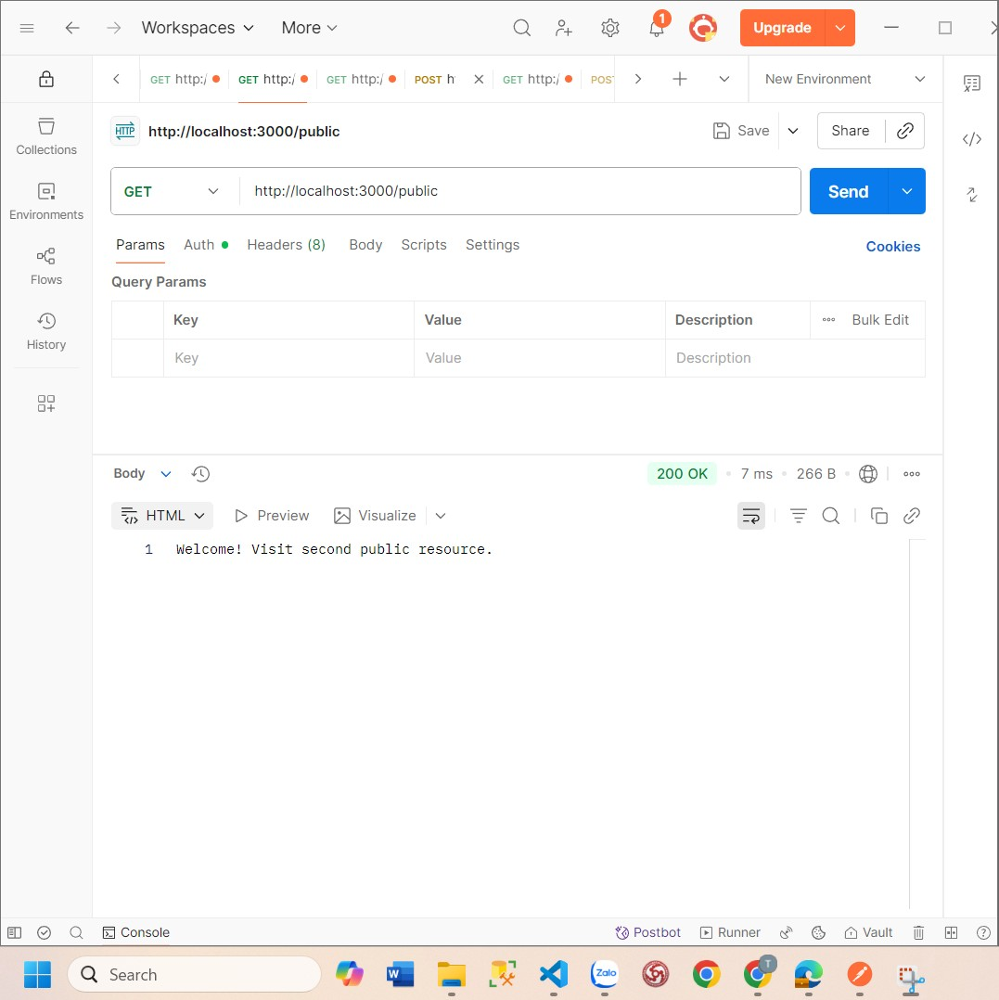
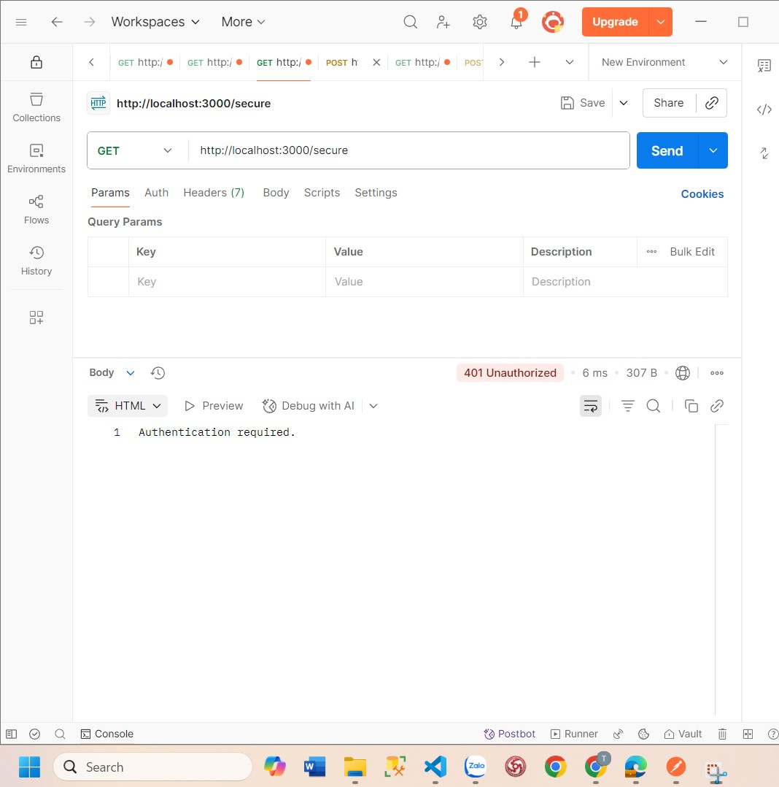
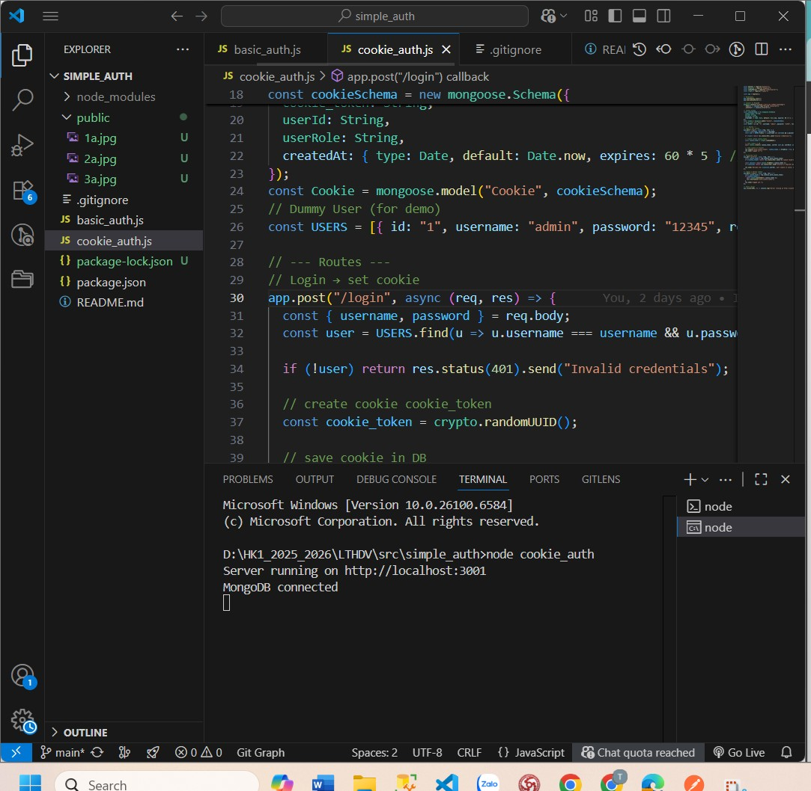
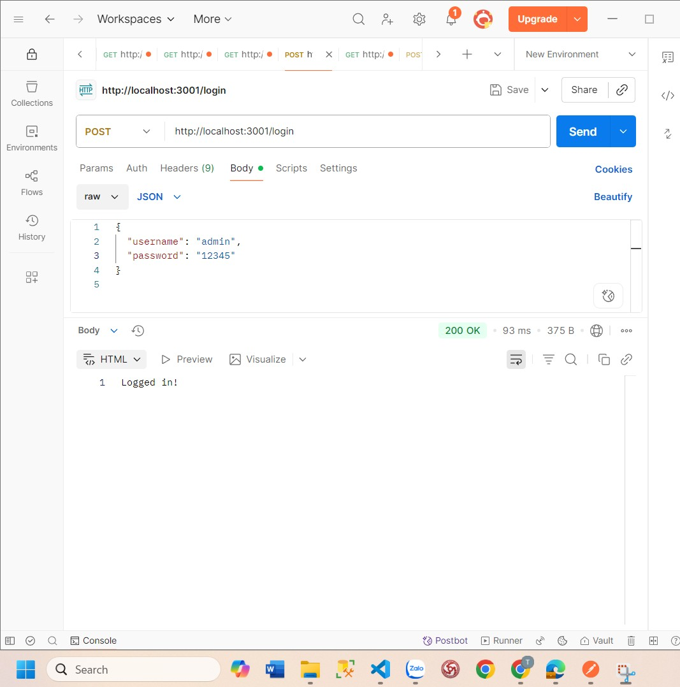
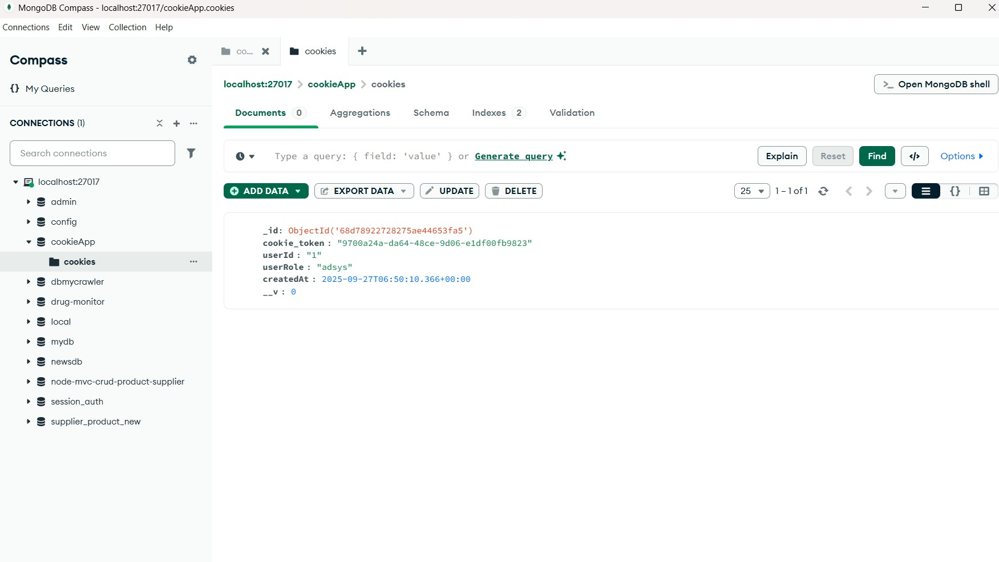
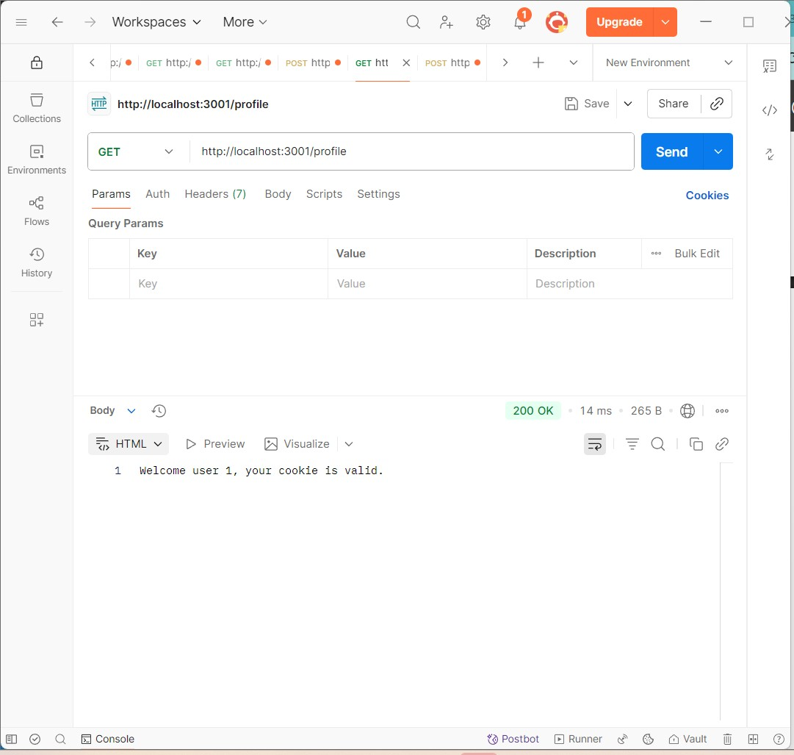
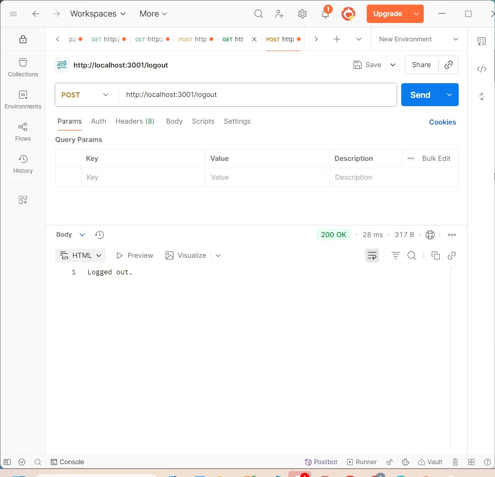
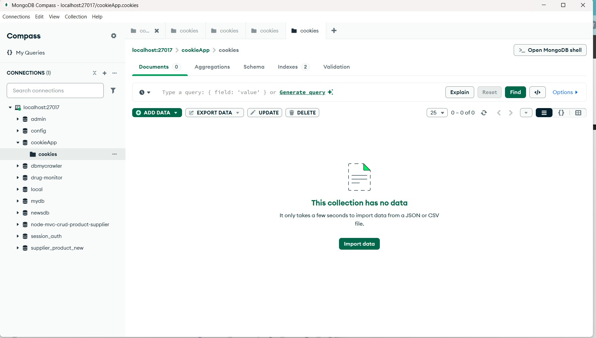
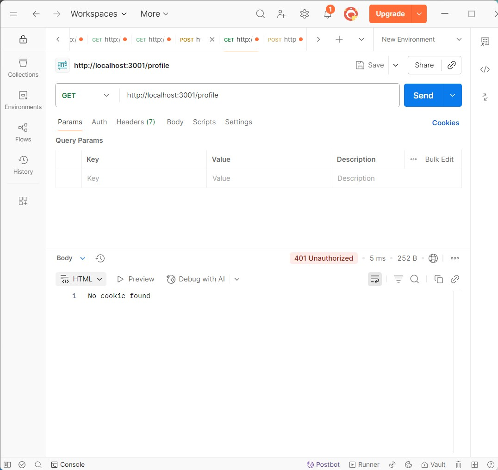

## 1. Basic Authentication (`basic_auth.js`)
### Steps to Test:
1. Run the server:
2. Open Postman and create a GET request to: `http://localhost:3000/`
3. Go to the **Authorization** tab, select **Basic Auth**.
4. Enter:
   - Username: `admin`
   - Password: `12345`
5. Send the request.
6. Check the response (e.g., 200 OK with "welcome" message).

### Screenshots:

2. Cookie Authentication (cookie_auth.js)
Steps to Test:
Run the server.
Open Postman and create a POST request to: http://localhost:3001/login.
Go to the Body tab, select raw, and enter JSON.
Send the request to set the cookie.
Check the Cookies tab in Postman to see the cookie.
Create a GET request to: http://localhost:3001/profile to test the protected route.
Send the request and verify the response.
Test logout functionality with a POST request to http://localhost:3001/logout.
Check data in MongoDB.
### Screenshots:

